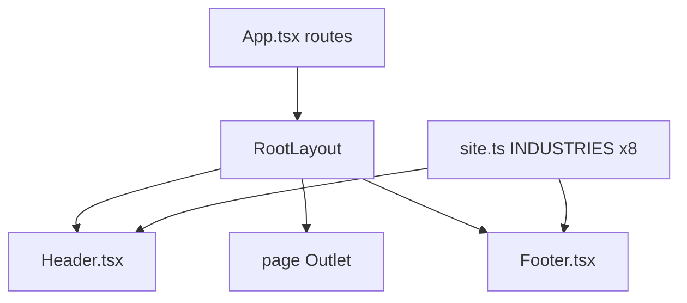

# Footer and Navigation Industry List

The priority-list ask is already mostly true in this codebase. Do not rebuild chrome. Fix the one list that is still truncated, then confirm every page is on the shared shell.

## What is already done



- Every route in [`src/App.tsx`](src/App.tsx) is a child of [`src/layouts/RootLayout.tsx`](src/layouts/RootLayout.tsx). That layout is the only place that mounts [`src/components/Header.tsx`](src/components/Header.tsx) and [`src/components/Footer.tsx`](src/components/Footer.tsx). No page ships its own header or footer.
- Header desktop dropdown and mobile menu already map the full array:

```29:31:src/components/Header.tsx
    children: [
      { label: 'All industries', href: '/industries' },
      ...INDUSTRIES.map((i) => ({ label: i.short, href: `/industries/${i.slug}` })),
```

- Home, `/industries`, location detail, and the apply form already list all eight, including `salons-spas` and `ecommerce` from [`src/data/site.ts`](src/data/site.ts).

## The actual bug

Footer still truncates the same source of truth:

```24:26:src/components/Footer.tsx
  {
    title: 'Industries',
    links: INDUSTRIES.slice(0, 6).map((i) => ({ label: i.short, href: `/industries/${i.slug}` })),
```

That drops the last two entries in `INDUSTRIES`:

- Salons & spas → `/industries/salons-spas`
- E-commerce → `/industries/ecommerce`

Contact, legal links, Client login (`SITE.loginUrl`), and company identity already come from `SITE` in the shared footer. Leave those alone.

## Implementation

1. In [`src/components/Footer.tsx`](src/components/Footer.tsx), drop `.slice(0, 6)` so the Industries column maps the full `INDUSTRIES` array. Labels stay `i.short` (`Salons & spas`, `E-commerce`) to match the header.
2. Add an `All industries` link to `/industries` at the top of that column, same as the header dropdown, so the two menus cannot drift again.
3. Do not change the footer grid (`lg:grid-cols-[1.4fr_repeat(3,1fr)]`). Eight short links plus “All industries” fit the existing column on desktop and stack cleanly on mobile (`md:grid-cols-2`).
4. Leave header `NAV`, legal row, Client login, phone, and logo untouched. They are already global.

Out of scope for this item: the footer CTA still says “See what your business qualifies for.” That is priority-list item 8, not this chrome fix.

## Regression coverage

Extend [`tests/navigation.spec.ts`](tests/navigation.spec.ts) so the footer Industries column cannot shrink again:

- Assert `footer nav[aria-label="Industries"]` contains `/industries`, `/industries/salons-spas`, and `/industries/ecommerce`.
- Assert that column’s industry hrefs match every `INDUSTRIES` slug (import the array or hard-list the eight paths). Existing `footer links all resolve` already GETs whatever is rendered.

## Verification

After the edit, check in the browser (desktop ~1280 and mobile ~390):

- Home footer: eight industry links plus All industries; Salons & spas and E-commerce present and clickable.
- Header Industries dropdown (desktop) and burger menu (mobile): still all eight.
- Spot-check `/apply`, `/legal/privacy`, `/industries/ecommerce`, and `/locations/new-york` to confirm the same header/footer (already guaranteed by `RootLayout`; this is the “no older chrome” check the ticket asks for).
- Confirm the taller Industries column does not overflow or collide with the legal row on either viewport.
