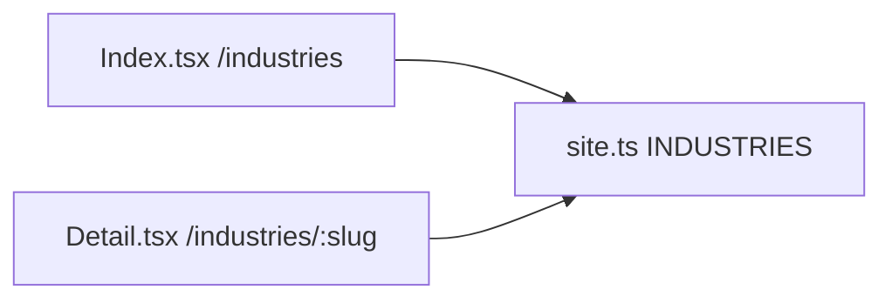

# Industry Pages Proofread and Content Cleanup

This is copy cleanup, not a redesign. All eight industry URLs (`/industries/restaurants` through `/industries/ecommerce`) render from one template plus one data array. Edits in the template land on every industry page at once.

## Architecture

- [src/pages/industries/Detail.tsx](src/pages/industries/Detail.tsx) — shared hero, FAQs, “Why underwriting”, “What to expect”, bottom CTA
- [src/pages/industries/Index.tsx](src/pages/industries/Index.tsx) — listing + the only industry-page CTA that still says “qualifies for”
- [src/data/site.ts](src/data/site.ts) — `INDUSTRIES` answers, use cases, ranges

Out of scope for this item: footer CTA and footer industry list (items 4/7), Home FAQ “frequently approved”, location-page “one month of revenue”.

## 1. Stop interpolating grammar in the template

The current `.replace(/s$/, '')` hack produces “salon & spa business” and “What restaurants clients use it for”. Add two fields on `Industry` in [src/data/site.ts](src/data/site.ts) so English is written once, not guessed:

- `singular` — used in FAQ questions (“a restaurant business”, “a salon or spa business”)
- `cashFlowNote` — one industry-specific sentence that replaces the duplicated “{name} are a clear example…” paragraph

| slug | singular | cashFlowNote direction |
|---|---|---|
| restaurants | restaurant | February vs July deposit dip |
| retail | retail | selling-calendar swings |
| medical-dental | medical or dental | insurance reimbursement lag |
| trucking-logistics | trucking | invoices settle after the load |
| construction-trades | construction | draws arrive in lumps |
| auto-repair | auto repair | season and weather swings |
| salons-spas | salon or spa | appointment and retail volume |
| ecommerce | e-commerce | cash locked in inventory 60–90 days |

Reword headings so they do not need plural/singular gymnastics:

- “What {short} clients use it for” → “Common uses in {short.toLowerCase()}”
- “{short} owners we've funded.” → “Owners we've funded in {short.toLowerCase()}.”
- “{name} are a clear example: …” → insert `{ind.cashFlowNote}`

## 2. Shared FAQ and “What to expect” (all 8 pages)

In [src/pages/industries/Detail.tsx](src/pages/industries/Detail.tsx):

**FAQ amount** — drop “one month of revenue” and hedge the claim:

- From: `{name} typically qualify for {range} … most offers land near one month of revenue.`
- To: `{name} may qualify for {range} at GLD Factoring LLC DBA GLD Funding. The amount is driven by average monthly deposits rather than credit score.`

**FAQ apply** — remove “Nothing else is required to submit” (also satisfies item 5):

- To: `4 months of recent business bank statements, plus basic business and owner details, to get started. Additional documents may be requested if your file needs them.`

**FAQ credit** — remove “frequently approved”:

- To: `We look beyond just a credit score. Underwriting reads business performance and cash flow to understand how the business actually moves money. A prior bank decline does not determine the outcome here.`

**What to expect** — delete the “one month of revenue” sentence. Keep remittance wording and the factor-rate sentence **without any numeric range**:

- Keep: “Cost is expressed as a factor rate. Your own rate depends on underwriting…”
- Do not add 1.20–1.49 or any other public range.

Detail bottom CTA already says “Ready to see your range?” — leave it.

## 3. Per-industry answers in site.ts

Rewrite only the two answers that still claim “frequently approved”:

**Retail** — replace the approval-claim clause with deposit-history wording, e.g. retailers with strong sales but an uneven monthly pattern can still be underwritten on deposit history rather than a bank-style credit file.

**Construction** — same treatment: lumpy cash flow is read from bank deposits, not framed as a frequent-approval guarantee.

Leave the other six answers as-is after a pass for grammar and MCA terminology. Restaurants already uses remittance language from item 3. Confirm no `repay` / `repayment` / `repaid` remains in any industry `answer`.

## 4. Industries index CTA

In [src/pages/industries/Index.tsx](src/pages/industries/Index.tsx) line 95:

- “See what your business qualifies for.” → “See what your business may qualify for.”

Sidebar `EligibilityCta` already uses “may qualify for”.

## 5. Verification

After edits, search industry-scoped files for:

- `one month of revenue`
- `frequently approved`
- `nothing else is required`
- `qualifies for` (should only remain if intentionally hedged as “may qualify”)
- `1.20`, `1.49`, `1.20–1.49`
- `repay|repayment|repaid`

Then check `/industries` plus all eight detail slugs in the browser (desktop and a mobile width), including FAQ open state, use-case headings, and the restaurants testimonial heading. Confirm FAQ schema still builds from the updated `faqs` array.
